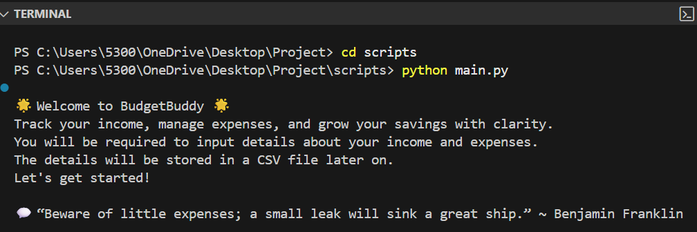

# 💼BudgetBuddy
 
**Track smarter. Save better. Grow consistently.**

My version of a budget tracker app  is your personal financial companion-simple, supportive, and smart.
BudgetBuddy is a user-friendly Python app that enables you to make better financial decisions.BudgetBuddy is more than a tracker. It is a motivational tool that helps you build better habits-one transaction at a time.

## ✅Table of contents

- [Overview](#Overview)
- [Features](#Features)
- [Installation](#Installation)
- [Usage](#Usage)

### ✨Overview

This Budget Tracker app is a Python application designed to help individuals manage their finances with clarity and control. It allows users to input income and expenses, and offers savings suggestions based on their disposable income.All data is saved in CSV(Comma-Separated Values) files for simplicity, easy access and future analysis.
The app includes motivational messages and predictive insights, helping users stay inspired while estimating their potential annual savings based on past behavior.
The app is also designed to encourage the users by analyzing their savings amount and predicting their annual savings.

### ✨Features

- **Warm Messages & Financial Quotes** 
Displays a welcome message and a randomly selected financial quotes at the beginning to set a positive tone. It also encourages user with savings messages based on their progress.
- **Income & Expense Input**
Collects detailed financial data including monthly income, tax rate, fixed expenses and daily spending via `input_handler.py`.
- **Smart Savings Suggestions**
Recommends savings strategies based on disposabe income. Offers auto-suggestions for high earners and flexible plans for others via [savings.py](scripts/savings.py)`savings.py`.
- **Income Distribution Visualization**
Displays a terminal-based bar chart and saves a PNG chart showing how income is allocated across catergories via `progress_chart.py`
- **Annual Savings Prediction**
Analyzes past CSV summaries to estimate yearly savings based on historical behavior via `predict_savings.py`
- **Dynamic File Saving**
Automatically saves budget data via `budget_saver.py` in CSV files in organized folders for easy tracking.
- **Modular Design**
Clean organized codebase with reusable modules(`main.py`, `input_handler.py`, `savings.py`, etc.) for clarity and maintainability.

### ✨Installation

To install and run **BudgetBuddy**, follow these steps:


1. _Clone the Repository_
```bash
git clone https://github.com/eelma05/python-project
cd Project
```

2. _Set up your Environment_

Make sure you have Python 3.8 or higher installed. You can check with:
```bash
python --version
```

3. _Install Required Packages_

BudgetBuddy uses `matplotlib` for chart generation.You can install dependencies with:
```bash
pip install matplotlib
```

4. _Run the App_

Navigate to the scripts folder and launch the main script:
```bash
cd scripts
python main.py
```

**Notes**

- Budget summaries will be saved in the `csv_reports/` folder.
- Progress charts will be saved in the `charts/` folder.
- These folders exist or will be created automatically when you run the app.

### ✨Usage

1.  _Launch the App_

 After navigating to the `scripts` folder, run the main script:
 ```bash
 python main.py
 ```
 The welcome message and a random financial quote will be displayed if the app ran successfully, like the one below.


```markdown
<p align="center">
  
</p>
```

2. Launch the app and follow the prompts to enter your income, expenses, and savings preferences.
2. View your income distribution in the terminal and as a saved PNG chart.
3. Your budget summary will be saved in the `csv_reports` folder
for future reference.
4. Run the annual savings predictor to estimate your yearly savings based on past data.